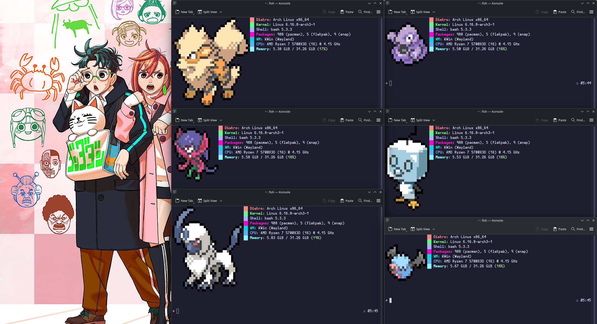

# Pokefetch - Random Pokémon System Info


## ✨ Overview

A custom Bash script that displays random Pokémon sprites alongside system information using fastfetch. **Now featuring truly random Pokémon selection** from all available generations instead of a limited list!

## 🎯 Features

| Feature | Description |
|---------|-------------|
| **Random Selection** | Chooses from ALL Pokémon using `pokeget random` |
| **Smart Fallback** | Falls back to random regions if primary method fails |
| **Dynamic Centering** | Automatically calculates optimal padding |
| **Multi-Shell Support** | Works with both Bash and Fish |
| **Region Support** | All regions: Kanto to Galar |
| **Privacy Focused** | Hides sensitive system information by default |

## 🛠 Requirements

- **pokeget-rs** - for fetching Pokémon sprites
- **fastfetch** - for system information  
- **Bash** 4.0+ - or any POSIX-compatible shell
- **Fish** - bash alternative

## ⚙️ Installation

### 1. Install Dependencies

**Arch Linux (AUR):**
```bash
yay -S pokeget fastfetch
```

**Other Distributions:**
```bash
# Install fastfetch
sudo apt install fastfetch  # Debian/Ubuntu
sudo dnf install fastfetch  # Fedora

# Install pokeget via cargo
cargo install pokeget
```

### 2. Install Pokefetch Script

```bash
# Create local bin directory if it doesn't exist
mkdir -p ~/.local/bin

# Save the script as pokemon.sh
cp pokemon.sh ~/.local/bin/
chmod +x ~/.local/bin/pokemon.sh
```

### 3. Shell Configuration

**For Bash** (add to `~/.bashrc`):
```bash
export PATH="$HOME/.local/bin:$PATH"
[ -t 1 ] && ~/.local/bin/pokemon.sh
```

**For Fish** (add to `~/.config/fish/config.fish`):
```fish
set -gx PATH $HOME/.local/bin $PATH

function fish_greeting
    bash ~/.local/bin/pokemon.sh
end
```

## 🎨 Configuration

You can customize these variables in the script:

```bash
FETCHER="fastfetch --config examples/21.jsonc"  # Fastfetch with custom config
EXTRA_PADDING_H=2             # Additional vertical padding  
EXTRA_PADDING_W=0             # Additional horizontal padding
WIDTH=15                      # Maximum sprite display width
```

## 🐛 Troubleshooting

**Problem**: Script doesn't execute  
**Solution**: Ensure script has execute permissions: `chmod +x ~/.local/bin/pokemon.sh`

**Problem**: Pokémon sprites not showing  
**Solution**: Verify pokeget installation: `pokeget bulbasaur --hide-name`

**Problem**: Fastfetch errors  
**Solution**: Update to latest version and check configuration

**Problem**: Config file not found  
**Solution**: Locate examples directory: `find /usr -name "21.jsonc" 2>/dev/null`

## 🔧 Technical Details

The script uses several Bash scripting techniques:

- **Conditional checks** for error handling
- **Array manipulation** for region fallbacks  
- **Dynamic calculation** for sprite positioning
- **Command substitution** for height/width detection
- **Privacy protection** by hiding sensitive system information


## 📄 License

This customization is released under the same spirit as the original - for everyone, as code should be.

The script uses external tools:
- `pokeget-rs` - Licensed under MIT
- `fastfetch` - Licensed under MIT

---

*Enjoy discovering a new Pokémon every time you open your terminal! 🎉*

## 🔗 Related Projects

- [pokeget-rs](https://github.com/talwat/pokeget-rs) - Pokémon sprite fetcher
- [fastfetch](https://github.com/fastfetch-cli/fastfetch) - System information tool





---
